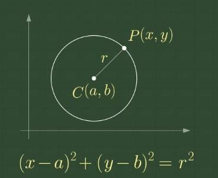

#  1002
##### [백준 링크](https://www.acmicpc.net/problem/1002)
---
## 📝 풀이
- 문제는 *스타크래프트*를 예시로 들고 있지만, 입력값을 잘 생각해보면 결국 ***두 원 사이의 접점의 개수를 구하는*** 좌표 문제이다.
- 총 입력을 6개나 받는데, 순서대로 다음과 같다.
	x1, y1, r1, x2, y2, r2 -> (첫번째 원의 x, y 좌표와 반지름 r), (두번째 원의 x, y 좌표, 반지름 r)
- 중학교 때 배웠던 원의 방정식을 생각해내면 쉽게 풀 수 있는 문제이다.



1. 원의 방정식 $$(x - a)^2 + (y - b)^2 = r^2$$
```위 식에서 r을 d라고 가정하면```
2. 두 원이 두 점에서 만날 때 $$r - r' < d < r + r'$$
3. 두 원이 한 점에서 만날 때 $$r - r' = d\quad or\quad r + r' = d$$
4. 두 원이 만나지 않을 때 $$r - r' > d \quad or \quad r + r' < d$$
---
## 💻 코드
```C++
#include <iostream>
#include <math.h>
using namespace std;

int abs(int num); //절댓값 반환 함수

int main()
{
	int* testCase = (int*)malloc(sizeof(int));

	int T; //입력 개수
	cin >> T;

	int x1, x2, y1, y2, r1, r2;
	float eq;

	for (int i = 0; i < T; i++)
	{
		scanf("%d %d %d %d %d %d", &x1, &y1, &r1, &x2, &y2, &r2);
		
		eq = sqrt((x1 - x2) * (x1 - x2) + (y1 - y2) * (y1 - y2)); //원의 방정식

		if (x1 == x2 && y1 == y2 && r1 == r2) //두 원이 겹쳐 있을 경우
		{
			testCase[i] = -1;
		}
		else if (eq == abs(r1 + r2) || eq == abs(r1 - r2)) //두 원이 한 점에서 만날 경우
		{
			testCase[i] = 1;
		}
		else if (eq > abs(r1 - r2) && eq < abs(r1 + r2)) //두 원이 두 점에서 만날 경우
		{
			testCase[i] = 2;
		}
		else //두 원이 만나지 않는 경우
			testCase[i] = 0;
	}

	for (int i = 0; i < T; i++)
		cout << testCase[i] << "\n";
}

int abs(int num)
{
	if (num >= 0)
		return num;
	else
		return -num;
}
```
---
# 💬 코멘트
- 원의 방정식이 갑자기 생각나지 않아서 애를 먹었다..
- 두 원의 위치관계가 생각보다 조건이 많고 까다로웠기 때문에 실버 3으로 책정된 듯 하다. 식을 알고나면 구현 자체는 어렵지 않다.
